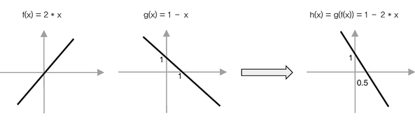

# Neural network

### 선형 모델의 한계와 XOR 문제

선형분류기의 문제: `XOR` 문제를 풀 수 없다

XOR문제처럼 직선 하나로 해결할 수 없는 비선형적 분포를 어떻게 구분하지? 
-> **함수 중첩, 활성화 함수**를 사용하면서 선을 구부리는 효과를 줄 수 있음  
-> 이 과정에서 `MLP`와 `Backpropagation` 알고리즘이 등장함!

 

### 신경망 역사

- 퍼셉트론
    
  - 1개의 선형함수 + 1개의 활성화함수(이때는 비선형 활성화 학습이 아님)
  - 학습 개념 도입
  - 선형분류기에 학습 개념(Weight, bias 업데이트) 을 추가한 것

- MLP
    
  - Multi Layer PErception MLP
  - 퍼셉트론 활용한 중첩 모델 사용, GD 사용
  - GD에 필요한 미분값을 계산하는 방법인 backpropagation 알고리즘이 만들어졌다.
  - **완전 연결**: 이전 층의 모든 뉴런이 다음 층의 모든 뉴런과 연결된 형태이다.

 

### 신경망 Neural network

신경망의 기본 수식은 선형 회귀와 같다.

$$y = Wx + b$$

- **Weight ($W$)**: 입력 데이터의 중요도(기울기)  
- **Bias ($b$)**: 데이터의 기본 편향치(절편)  

학습의 목표: 실제 정답과 예측값 사이의 오차(MSE 등)가 최소가 되는 최적의 $W$와 $b$를 찾는 것 

### 계층 구조 (Layer)

신경망은 뉴런들이 층을 이루어 연결된 구조이다. 

- **입력층(Input Layer)**: 데이터 입력 층

- **은닉층(Hidden Layer)**: 
  - 특징을 추출, 패턴 학습 
  - 층이 깊어질수록 더 추상적인 정보를 학습한다.

- **출력층(Output Layer)**: 최종 예측값 출력층

 

### 학습 알고리즘

`순전파 -> 오차 계산 -> 역전파 -> 가중치 갱신`

- **순전파 (Forward Propagation)**: 
  - 입력을 가중치에 곱하고 활성화 함수를 거쳐 결과값을 계산

- **손실 함수 (Loss Function)**: 
  - 결과값이 정답과 얼마나 다른지 점수를 매긴다 (`MSE`, `Cross-Entropy`).

- **역전파 (Backpropagation)**: 
  - Chain Rule을 이용해 출력층부터 입력층 방향으로 오차를 전달하며, 각 가중치가 오차에 얼마나 기여했는지(Gradient) 계산

- **최적화 (Optimizer)**
  - 목표: 손실 함수의 최소화
  - 최적화 도구 경사하강법(`SGD`, `Adam` 등)을 사용해 $w$와 $b$ 업데이트

 

### 활성화 함수(Activation Function)

단순히 함수를 중첩하면 또 다른 선형함수가 된다.

  

비선형성을 부여하기 위해 활성화 함수가 필요함!  

- **Sigmoid** :
  - 초기 모델에서 사용했음

  - **1. 기울기 소실 문제**
    - `sigmoid` 함수의 도함수  $sigmoid(x)(1−sigmoid(x))$
    - 0에서 0.25 최댓값을 같는다 ( == `sigmoid`의 미분값은 0에서 최대)
    

  - **2. 출력값이 not zero-centered**
    - `sigmoid`의 출력 범위는 `[0, 1]`-> 항상 양수가 나온다.
    - 다음 뉴런 입장에서 입력값이 항상 양수이면, 가중치에 대한 미분기호가 모두 같게 된다.
    - 최적의 경로로 바로 내려가지 못하고지그재그로 수렴하게 됨 -> 속도 느려짐
    

  - **3. 연산 비용이 높음**
    -  $e^{-x}$ 지수 함수 계산 연산 비용이 높다

- **ReLU** :
  - Sigmoid의 한계 극복
  - $f(x) = \max(0, x)$
  - 양수는 그대로 전달, 음수는 0으로 전달한다.
  - 계산이 빠르고 심층 신경망 학습에 유리해 많이 쓰인다.

    

     
     

활성화 함수를 사용한 모델은 단순 퍼셉트론으로는 표현할 수 없었던 XOR 문제의 곡선 인터페이스를 예측할 수 있다!

 

 

### Shallow vs Deep Network

#### (1) Hidden Unit & Hidden Layer
* **Hidden Unit (은닉 유닛):** 
  * 층을 구성하는 개별 뉴런
* **Hidden Layer (은닉층):** 
  * 은닉 유닛들이 모여 구성된 하나의 계층 유닛이 개별 연산 단위
  * 은닉층은 그 단위들이 병렬로 배치된 구조적 단계

#### (2) 얕은 신경망 (Shallow Network)

* **구조:** 입력층, **단일 은닉층**, 출력층

* **원리 (Piecewise Linear):** 
  * ReLU와 같은 활성화 함수를 사용하면 각 은닉 유닛은 입력 공간을 특정 지점에서 꺾는 역할을 수행 
  * 이 유닛들의 출력을 합치면 조각별 선형 함수(Piecewise Linear Function)가 생성되어 비선형적인 데이터 분포를 근사할 수 있다.

* **범용 근사 정리 (Universal Approximation Theorem):** 
  * 은닉 유닛을 충분히 많이 배치한다면, 단일 은닉층만으로도 임의의 연속 함수를 원하는 정밀도로 근사할 수 있다는 수학적 정리

* **한계:** 이론적으로는 가능하나, 복잡한 패턴을 학습하기 위해 필요한 유닛(파라미터) 수가 기하급수적으로 증가하여 연산 효율성이 극도로 떨어진다.

#### (3) 깊은 신경망 (Deep Network)

* **네트워크 합성 (Composition):** 
  * 깊은 신경망은 각 층의 출력이 다음 층의 입력이 되는 **함수 합성($f(g(h(x)))$)** 구조이다. 
  * 이를 통해 단순한 특징들을 조합하여 고차원적인 특징을 단계적으로 추출한다.

* **Folding:** 
  * 각 층은 활성화 함수를 통해 입력 공간을 '접는' 효과를 준다. 
  * 이는 복잡하게 얽힌 데이터를 분류하기 쉬운 형태로 변환하는 과정이다.

* **지수적 표현력:** 
  * 얕은 신경망은 유닛 수($N$)에 비례하여 선형 구역을 늘리지만, 깊은 신경망은 층의 깊이($L$)에 따라 선형 구역을 **지수적($2^L$)**으로 늘린다. 

* **효율성:** 파라미터 수가 비슷하더라도 깊은 구조를 가질 때 훨씬 더 복잡한 비선형 경계를 효율적으로 생성할 수 있다. 

특징
- 깊은 layer 갖는 경우가 많다
  - 깊은 layer 갖는 이유 : (6+1) < (3+1)*(3+1) 
- 대량 데이터가 필요하다
- 대규모 연산이 필요(gpu -> 병렬 계산 가능)

딥러닝을 나누는 기준?
- 정확히 몇 개의 layer부터 딥러닝인지 정해지지 않았음
- feature의 개수도 정해지지 않음
- 그럼 뭐가 딥러닝? -> 특징을 **자동으로** 찾아내면 딥러닝

 

### references
- [What is a neural network? | Types of neural networks](https://www.cloudflare.com/ko-kr/learning/ai/what-is-neural-network/)
- [인공지능(AI) & 머신러닝(ML) 사전](https://wikidocs.net/book/5942)
- [[Deep Learning] 활성화 함수 - Sigmoid 함수](https://velog.io/@js03210/%ED%99%9C%EC%84%B1%ED%99%94-%ED%95%A8%EC%88%98-Sigmoid-%ED%95%A8%EC%88%98)
- [Deep Learning: How do deep neural networks work?](https://lamarr-institute.org/blog/deep-neural-networks/)